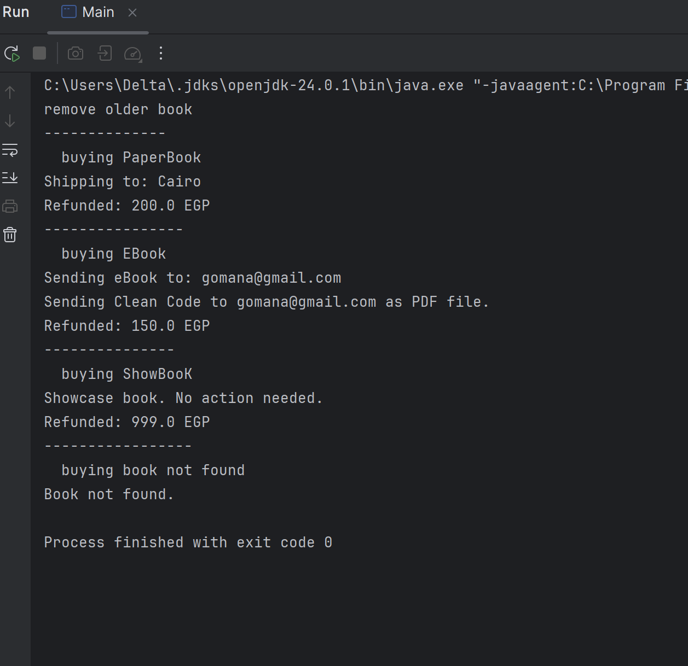

 Quantum Bookstore 

A modular Java console application that simulates a digital bookstore.  
Built using solid Object-Oriented Programming (OOP) principles, this project is structured for clarity, scalability, and clean logic separation.

---

🚀 Features

- Allows adding books of different types:
  -  Paper Books (shipped to address, with quantity)
  -  E-Books (sent to email as file)
  -  Showcase Books (display-only, not for sale)
- Removes outdated books (based on age)
- Finds a book by ISBN
- Centralized buy() logic that:
  - Checks availability
  - Decides whether to ship or send by email
  - Prints transaction result

---
🗂 Project Structure

